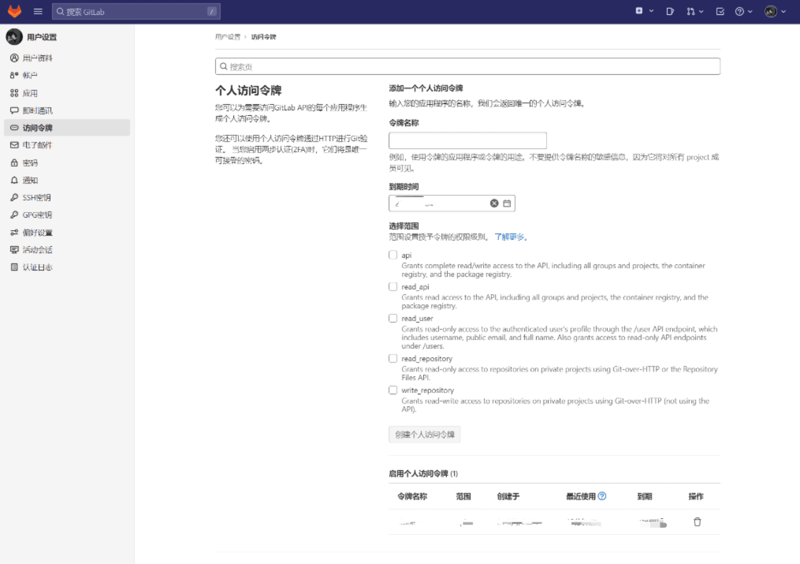

# git-clone

本项目提供Python脚本用于下载gitlab中的项目资源文件

## 要求

python版本大于等于3.10

## 运行

找到`config`文件夹，在`config-template.json`中填写Gitlab的token和address字段（其中token可以在访问令牌中添加），并将其重命名为`config.json`



```json
{
  "gitlabToken": "xxxxxxxxxxxxxxx",
  "gitlabAddress":"127.0.0.1:8080"
}
```

根据项目需求在`main.py`里调用相应函数

下面是clone根目录下所有项目的代码示例：

```python
# clone根目录下所有项目
def clone_all_projects():
    gitlab = ProjectGitLabInfo(address=GITLAB_ADDR, token=GITLAB_TOKEN)
    gitlab.clone()


# clone某个组下所有项目
def clone_group_projects(group_id: int):
    gitlab = GroupGitLabInfo(address=GITLAB_ADDR, token=GITLAB_TOKEN)
    gitlab.clone(group_id)


# 根据id clone所有项目
def clone_projects_by_ids(project_ids: list[int]):
    gitlab = ProjectGitLabInfo(address=GITLAB_ADDR, token=GITLAB_TOKEN)
    for project_id in project_ids:
        gitlab.clone(project_id)
        
clone_all_projects()

```

ps：根据id clone（clone_projects_by_ids）项目能有效节约计算机的进程资源，建议不要使用clone_all_projects方法

运行`main.py`

```python
cd src
python main.py
```

